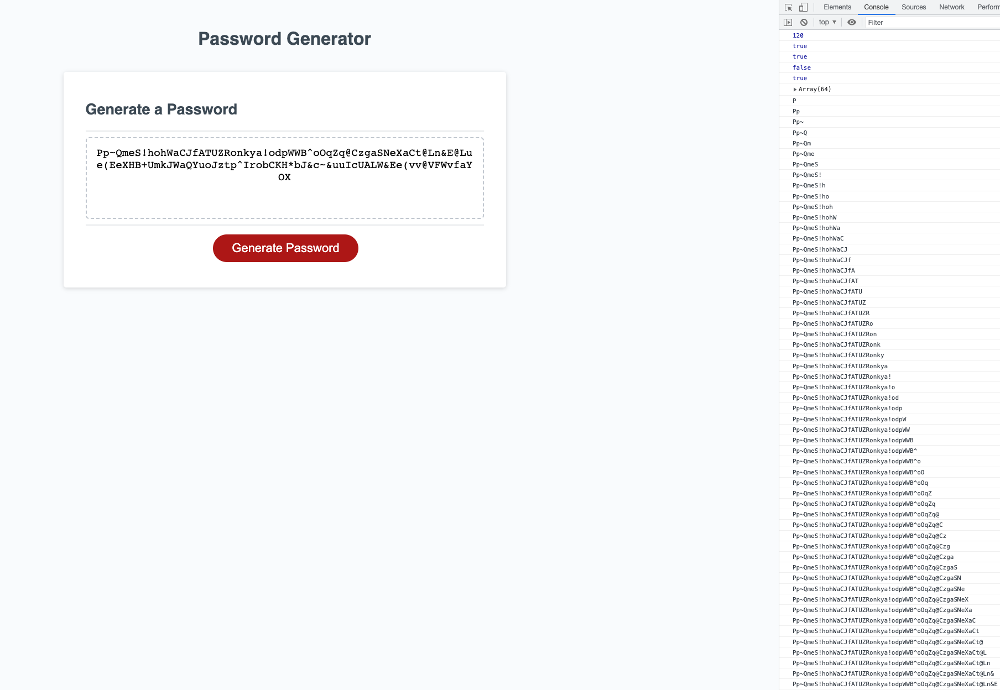

# Password-Generator

## Description

This is a password generator website. It will create a secure and random password that will make it very hard for someone to guess. When clicking the 'Generate' button, the website will prompt and ask you how how long you would like your password from 8 to 128 characters and if you would like to include Special Characters, Uppercase Letters, Lowercase Letters and/or Numbers. After selecting the criteria, you will be presented with your new password!

After completing this assignment, I must say I can read Javascript a whole lot better now!

## Installation

N/A

## Usage

The screenshots below show the generated password and a console log on the right that shows what the user chose and how the program added each random character to the password depending on what the user chose. 

Screenshot

Link to Website is below

## Credits

N/A

